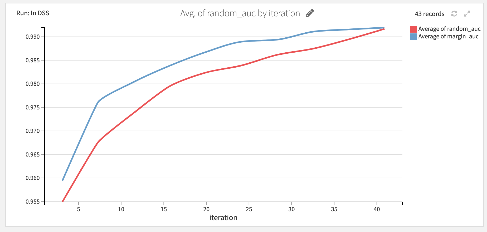

# Labeling &amp; Active Learning Plugin  

The Labeling and Active Learning plugin provides webapps to label your data — tabular, images or sound — and boost your efficiency through an active learning framework.

In fact, not all samples bring the same amount of information to a model. In particular, a sample will not bring a lot of
information to the model if it is similar to an already labeled sample. Active learning estimates how much information a
sample can bring to a model and select them to make the annotation process more efficient. As an example, see how active
learning performs compare to random sample annotation on a task of predicting wine color:

  

## Description  

This plugin offers a collection of visual webapps to label data — whether tabular, images or sound — and
proposes to set up an active learning loop that seemlessly select the samples to label that maximize model
performance.

- [Data Labeling (webapp)](#labeling-webapp)
- [Score an unlabeled dataset (recipe)](#active-learning-recipe)
- [Set up a Active Learning scenario (scenario)](#active-learning-scenario)

## When to use this plugin

The webapp purpose is to ease the labeling through an intuitive UI. If you plan to label all your dataset, this is all you need. However, if your budget is limited and you can only label part of your dataset, this plugin provides an active learning framework
— composed of a recipe and a scenario — to embed your labeling procedure inside an iterative process that proposes the best sample to annotate.

### Labeling Webapp
First, select the webapp that best suits the data to be labeled.

All labeling webapps propose the same settings. For image labeling, those are: 

  

- `Images to label` - managed folder containing unlabeled images.

- `Categories` - set of labels to be assigned to images.

- `Labeling status and metadata` - dataset name for the labeling metadata.

- `Labels dataset` - dataset to save the labels into.

- `Label column name` - column name under which the manual labels will be stored.

- `Queries` (optional) - dataset containing the unlabeled data with an associated uncertainty score.
  
Note that the latter `queries` dataset is optional as labeling can always be done without Active Learning. In this case the user will be offered to label samples in a random order. 

Once the settings are set, it's important to allow the webapp access to the corresponding datasets:
  

After the webapp is started, the annotation process can start.
  

### Active Learning Recipe  

When a sufficient number of samples has been labeled, a classifier from the DSS Visual Machine Learning interface can be trained to predict the labels, and be deployed in the project's flow. 
In order to later used the Active Learning plugin, it's required to use a **python3** environment to train the model. [Here's a link describing how to create a new code environment in DSS ](https://doc.dataiku.com/dss/latest/code-envs/operations-python.html#create-a-code-environment). Make sure that it's based on **python3**.  

From the Labeling and Active Learning plugin, after the Query Sampler recipe is selected, the proposed inputs are:
 
 - `Classifier Model` - deployed classifier model.
  
 - `Unlabeled Data` - dataset containing the raw unlabeled data.
  
 - `Data to be labeled` - dataset containing the unlabeled data with an associated uncertainty score.

There is only one setting to choose from, the Active Learning strategy.
 

This plugin proposes the three most common active learning strategies: Smallest confidence, Smallest margin,
and Greatest entropy. All fo them are equivalent in a binary classification setting. In order to explain each of these strategies in a multiclass case, we define the sorted vector of class probabilities:

#### Smallest confidence

Smallest confidence is simply a confidence score based on the probability of the most probable class. It
is defined mathematically by:

This is the most simple approach. However, since we are in a multiclass setting, the probability of the second class may be very close to the first, in which case the model is struggling to classify the sample, but it can also be very far, and it just means that the sample is not very representative of its class.

#### Smallest margin

Smallest margin approach tackles this issue by looking at the difference between the two top probabilities:

Since we take into account the second best strategy, we may as well take into account all of them.

#### Entropy

Shannon's entropy measures the information carried by a random variable. We can use it to measure the information contained in the prediction. We use the classical definition of entropy:

In order to have an homogeneous output, we normalize it to have values between 0 and 1.

### Active Learning Scenario

The Active Learning process is instrisically a loop in which the samples labeled so far and the trained classifier are leveraged to select the next batch of samples to be labeled. This loop takes place in DSS through the webapp, that takes the queries to fill the training data of the model, and a scenario that regularly train the model and generate the new queries.

To set up this scenario, this plugin proposes a custom trigger that can be used to retrain the model every `n` labelings. Here are the steps to follow to put in place the training: 

- Create the scenario, add a custom trigger `Every n labeling`.

  

The following is then displayed: 

  

Last but not least, the following three steps constitutes the full Active Learning scenario:

  

# License

The Labeling and Active Learning plugin is:

   Copyright (c) 2019 Dataiku SAS
   Licensed under the [MIT License](LICENSE.md).
