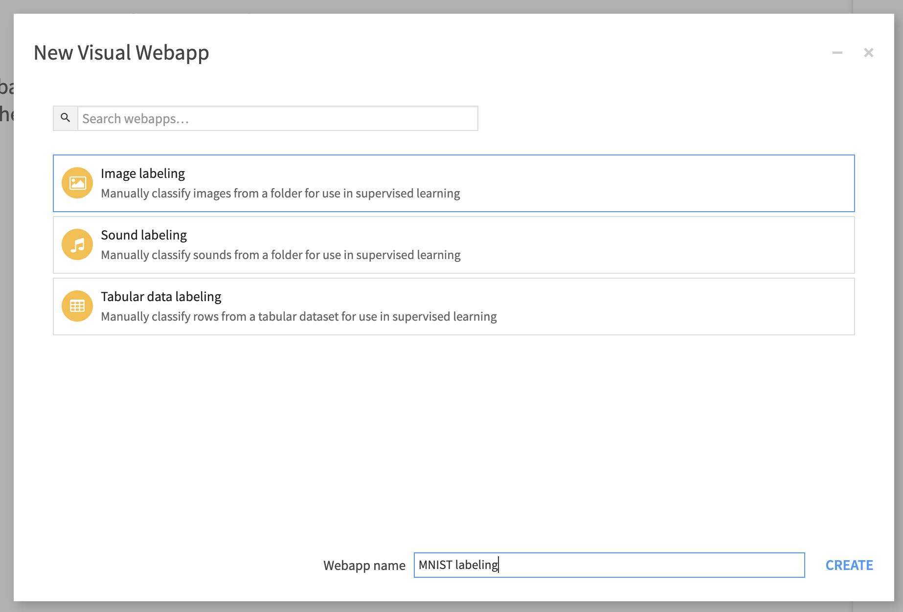
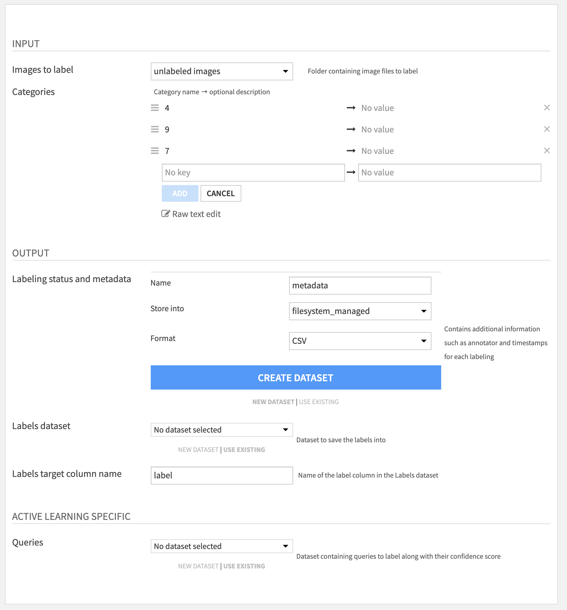
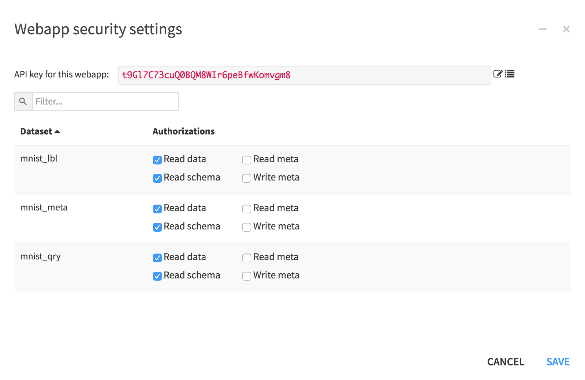
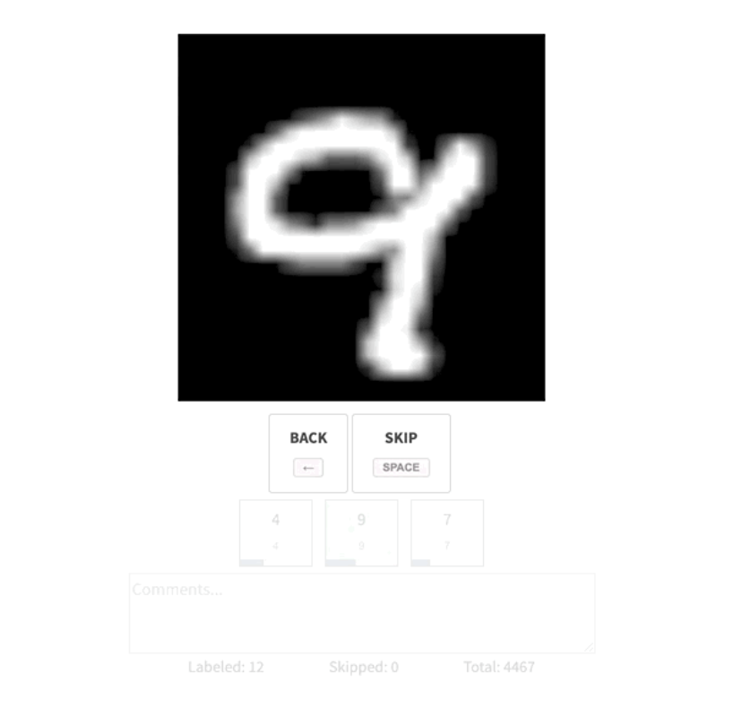
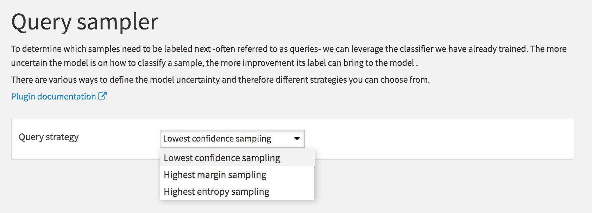
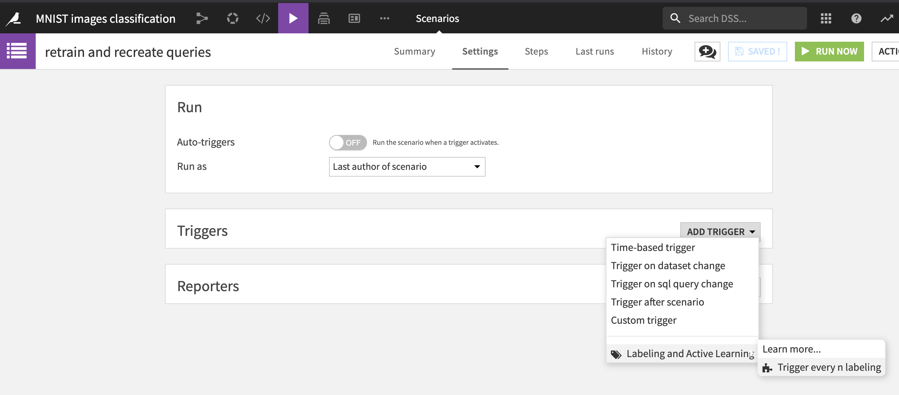
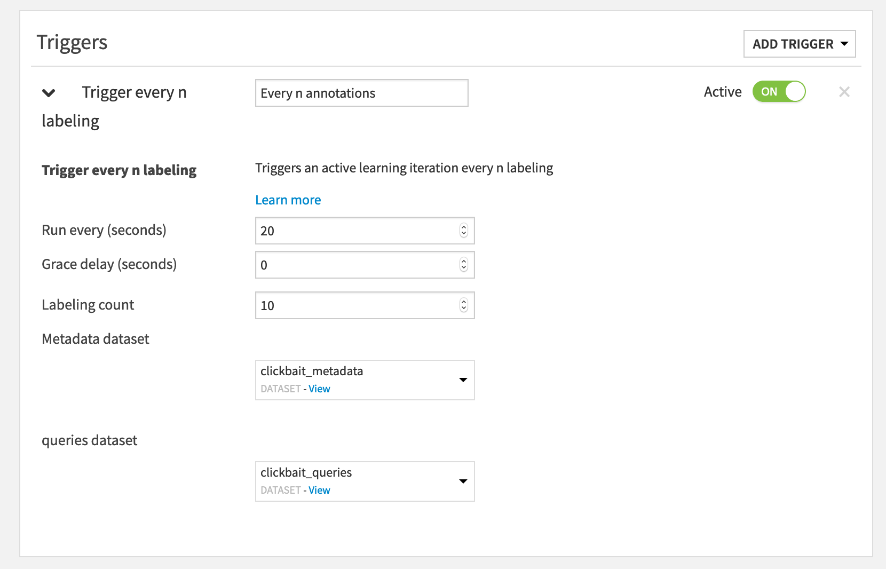
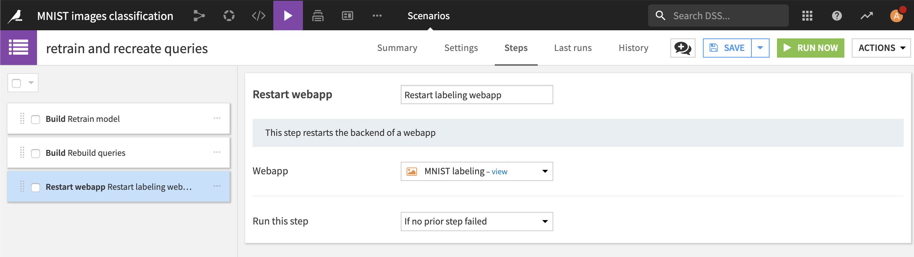

# Labelling &amp; Active Learning Plugin  

The Labeling and Active Lerning plugin let you label your data (tabular, images or sound) efficiently by leveraging webapps and active learning recipes.  

## Description  

This plugin offers a collection of visual webapps to label data (whether tabular, images or sound), a visual recipes to determine which samples need to be labeled next, as well as visual scenario trigger.
- [Data Labeling (webapp)](#labeling-webapp)
- [Score an unlabeled dataset (recipe)](#active-learning-recipe)
- [Set up a Active Learning scenario (scenario)](#active-learning-scenario)

## When to use this plugin  
The webapp purpose is to ease the labeling through an intuitive UI. Leveraging the Active Learning recipe and scenario, this then becomes an iterative process. 

### Labeling Webapp
First, select the webapp that best suits the data to be labeled.

All labeling webapps propose the same settings. For image labeling, those are: 

  

- `Images to label` - managed folder containing unlabeled images.

- `Categories` - set of labels to be assigned to images.

- `Labeling status and metadata` - dataset name for the labeling metadata.

- `Labels dataset` - dataset to save the labels into.

- `Label column name` - column name under which the manual labels will be stored.

- `Queries` (optional) - dataset containing the unlabeled data with an associated uncertainty score.
  
Note that the latter `queries` dataset is optional as labeling can always be done without Active Learning. In this case the user will be offered to label samples in a random order. 

Once the settings are set, it's important to allow the webapp access to the corresponding datasets:
  

After the webapp is started, the annotation process can start.
  

### Active Learning Recipe  

When a sufficient number of samples has been labeled, a classifier from the DSS Visual Machine Learning interface can be trained to predict the labels, and be deployed in the project's flow. 
In order to later used the Active Learning plugin, it's required to use a **python3** environment to train the model. [Here's a link describing how to create a new code environment in DSS ](https://doc.dataiku.com/dss/latest/code-envs/operations-python.html#create-a-code-environment). Make sure that it's based on **python3**.  

From the Labeling and Active Learning plugin, after the Query Sampler recipe is selected, the proposed inputs are:
 
 - `Classifier Model` - deployed classifier model.
  
 - `Unlabeled Data` - dataset containing the raw unlabeled data.
  
 - `Data to be labeled` - dataset containing the unlabeled data with an associated uncertainty score.

There is only one setting to choose from, the Active Learning strategy.
  

### Active Learning Scenario

The Active Learning process is instrisically a loop in which the samples labeled so far and the trained classifier are leveraged to select the next batch of samples to be labeled. This loop takes place in DSS through the webapp, that takes the queries to fill the training data of the model, and a scenario that regularly train the model and generate the new queries.

To set up this scenario, this plugin proposes a custom trigger that can be used to retrain the model every `n` labelings. Here are the steps to follow to put in place the training: 

- Create the scenario, add a custom trigger `Every n labeling`.

  

The following is then displayed: 

  

Last but not least, the following three steps constitutes the full Active Learning scenario:

  

# License

The Labeling and Active Lerning plugin is:

   Copyright (c) 2019 Dataiku SAS
   Licensed under the [MIT License](LICENSE.md).
